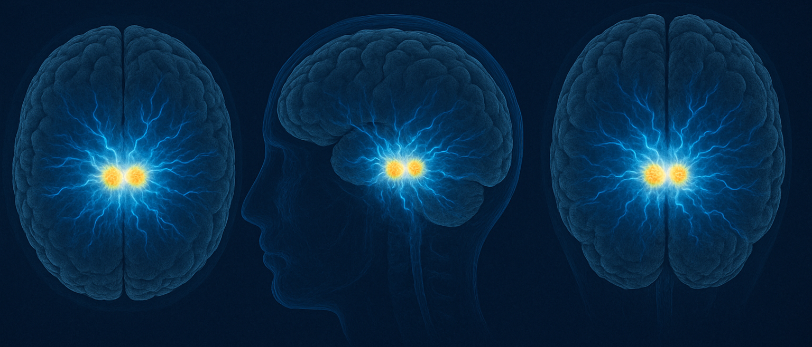

# Beta Activity and Neuroimaging Concordance in Subthalamic Nucleus Deep Brain Stimulation

This repository contains the analysis code for the research paper "Beta Activity and Neuroimaging Concordance in Subthalamic Nucleus-Deep Brain Stimulation: Implications for Electrode Localization and Clinical Outcomes."

## Overview

This project analyzes the relationship between beta oscillatory activity, neuroimaging data, and clinical outcomes in patients with Parkinson's disease who have undergone subthalamic nucleus deep brain stimulation (STN-DBS).

## Repository Structure

The analysis is organized into four Jupyter notebooks that should be executed in the following order:

1. **preprocessing.ipynb** - Initial data preprocessing and preparation
2. **general.ipynb** - General statistical analyses and visualizations
3. **contingency.ipynb** - Contingency table analyses between LFP and Neuroimaging
4. **UPDRS.ipynb** - UPDRS (Unified Parkinson's Disease Rating Scale) clinical outcome analyses

## Important Notes

**This is not an automated pipeline.** These notebooks are designed as a reference implementation rather than a ready-to-run analysis pipeline. 

- Data acquisition methods vary between research sites and patients
- The notebooks assume you have your own preprocessed data in the appropriate format
- Each cell is commented to explain the analytical steps
- You will need to adapt the code to your specific data structure and file paths

## Requirements

The code requires Python 3.x and standard scientific computing libraries including:
- NumPy
- Pandas
- Matplotlib
- Scipy
- Seaborn
- Statsmodels
- Jupyter Notebook

Please see requirements.txt 

## Contact

For questions regarding the analysis methods or code implementation, please open an issue in this repository or contact razkinmalen@gmail.com
